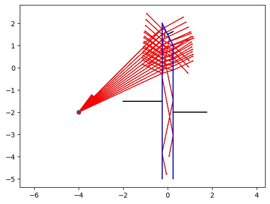
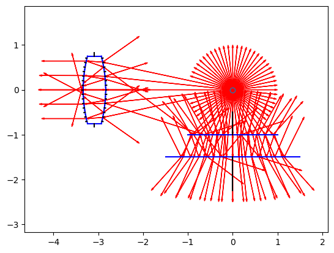

# PlanoLux

<!-- WARNING: THIS FILE WAS AUTOGENERATED! DO NOT EDIT! -->

This file will become your README and also the index of your
documentation.

## Install

``` sh
pip install planolux
```

## How to use

This is an example of a prism. [Figure 1](#fig-prism)

``` python
surf = []
surf.append(Surface(Point(4,2), Point(2,2), n2=1.5))
surf.append(Surface(Point(3,0), Point(4,2), n2=1.5))
surf.append(Surface(Point(2,2), Point(3,0), n2=1.5))

# Source Point
sp    = Point(0.0,1.0)

# Initial Rays
rays_out = gen_rays(sp, -10, 10, 5, endpoint=False)

rays_all = raytrace(rays_out, surf)

plot_scene(rays_all, surf, sp, raycol='red')
```


``` python
W = 0.5
surf = []
surf.append(Surface(Point(W/2,-5), Point(W/2,1.0), n2=1.5))
surf.append(Surface(Point(-W/2,2), Point(-W/2,-5), n2=1.5))

surf.append(Surface(Point(W/2,1.0), Point(-W/2,2.0), n2=1.5))


# Source Point
sp    = Point(-4,-2)

# Initial Rays
rays_out = gen_rays(sp, 25, 55, 15, endpoint=False)

rays_all = raytrace(rays_out, surf)
plot_scene(rays_all, surf, sp, raycol='red')
```

    /Users/michaeljohnson/Dev/planolux/planolux/core.py:210: RuntimeWarning: invalid value encountered in sqrt
      rs = ((n1*np.cos(ai) - n2*np.sqrt(1-(n1/n2*np.sin(ai))**2))/(n1*np.cos(ai) + n2*np.sqrt(1-(n1/n2*np.sin(ai))**2)))**2
    /Users/michaeljohnson/Dev/planolux/planolux/core.py:211: RuntimeWarning: invalid value encountered in sqrt
      rp = ((-n2*np.cos(ai) + n1*np.sqrt(1-(n1/n2*np.sin(ai))**2))/(n2*np.cos(ai) + n1*np.sqrt(1-(n1/n2*np.sin(ai))**2)))**2
    /Users/michaeljohnson/Dev/planolux/planolux/core.py:167: RuntimeWarning: invalid value encountered in sqrt
      f = r*c - np.sqrt(1-r**2*(1-c**2))



``` python
surf = []
surf.append(Surface(Point(1.0,-1.0), Point(-1.0,-1.0)))
surf.append(Surface(Point(-1.5,-1.5), Point(1.5,-1.5)))

# surf.append(Surface(Point(1.0,1), Point(1.0,-1.0)))
# surf.append(Surface(Point(1.5,-1.5), Point(1.5,1.5)))


N = 16
R1 = 3.0
R2 = R1
T  = 0.5
H  = 0.75

# 1/f = (n2-1)(1/R1+1/r2)-(n2-1)**2*d/(n2*R1*r2)
n = surf[0].n2
fin = (n-1)*(1/R1+1/R2)-((n-1)**2)*T/(n*R1*R2)

XL = -1/fin
print(1/fin)
#print(np.arcsin(surf[0].n1/surf[0].n2)*180.0/np.pi)
#XL = -5

su = lens(R1, R2, T, H, XL, N=16)
for ss in su:
    surf.append(ss)

# Source Point
sp    = Point(0.0,0.0)

# Initial Rays
rays_out = gen_rays(sp, -180, 180, 60, endpoint=False)
rays_all = raytrace(rays_out, surf, reflect_rays=False)
plot_scene(rays_all, surf, sp, raycol='red')
```

    3.085714285714286


